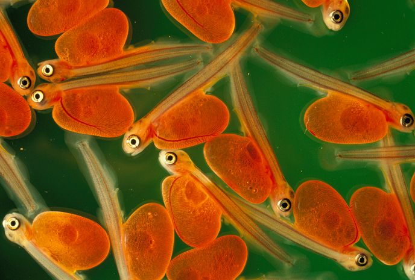

# Rmd Basics for crafting your document {#RmdTools}


## Output 

* Generally stick with html
* In the output section in the YAML, you can choose "pdf_document", "word_document" or "html_document." 
* I have chosen bookdown::html_document2, which allows for certain features like auto-numbering for figures/tables, referencing figures/tables, sections 

## Display

### Font

* _Italics_: `_text_` or `*text*`
* __Bold__: `__text__` (two underscores) or `**text**`
* Subscripts e.g. H~2~O `H~2~O`

### Blockquotes

Use `>`  

    > "The mission of the Bureau of Reclamation is to manage, develop, and 
    > protect water and related resources in an environmentally and
    > economically sound manner in the interest of the American public." 
    > 
    > --- Bureau of Reclamation

> "The mission of the Bureau of Reclamation is to manage, develop, and 
> protect water and related resources in an environmentally and
> economically sound manner in the interest of the American public." 
> 
> --- Bureau of Reclamation

### Indent Text  

Use `|`  

    | Here you can 
    |  indent and separate 
    |   lines
    |    for fun 
    |   patterns
    |  like
    | this 

| Here you can 
|  indent and separate 
|   lines
|    for fun 
|   patterns
|  like
| this 

### Text in a gray block   
Enclose in ` ``` `  or indent by 4 spaces  

    ``` 
    Here is a chunk of code 
    ```    
Result:  
```
Here is a chunk of code
```

### Equations   
Equations  
Surround with `$`

    $a^2 + b^2 = c^2$  

$a^2 + b^2 = c^2$.


Alternatively for a more complicated equation:   


    \begin{equation} 
      f\left(k\right) = \binom{n}{k} p^k\left(1-p\right)^{n-k}
      (\#eq:binom)
    \end{equation} 


(The \#eq:binom can be used to reference this equation later)


\begin{equation} 
  f\left(k\right) = \binom{n}{k} p^k\left(1-p\right)^{n-k}
  (\#eq:binom)
\end{equation} 
    
## Organization

### Headers: 

`# Header 1 (Largest)`  
`## Header 2`  
`### Header 3`  

### Header with no numbering: {-} 

`### Header {-}`

### Lists: 

#### Use `*`, `-`, or `+`

    * peas
    * apples
    * carrots
      * baby
      * large
        * colored
        * orange

* peas
* apples
* carrots
  * baby
  * large
    * colored
    * orange
    
#### Use numbers:

    1. Enter data
    2. QAQC
    3. Publish Data  

1. Enter data
2. QAQC
3. Publish Data

  
### Tabs {.tabset .tabset-pills}

Use `{.tabset}` and header levels. Sub-headers (exactly one level down) will become tabs.  
` ### Project {.tabset} `   
` #### Part A `  
` #### Part B `  

### Code, Plotting, Captions
#### Code

* Insert R Chunk  
* Write code in chunk


```{r code}
data("iris")
summary(iris)
```

#### Plot
```{r plot, fig.align = 'center'}
library(ggplot2)
ggplot(iris, aes(x = Sepal.Length, y = Petal.Length)) + geom_point()
```

#### Figure options
* fig.align = "center" "right" "left"
* fig.asp = ratio of width:height, height is calculated from fig.width*fig.asp
* fig.margin = TRUE (place figure in figure margin)
* fig.fullwidth = TRUE (figure is across full width)
* fig.width
* fig.height
* fig.dim = c(8,6) (width, height)
* fig.link - add a link to the figure
* fig.cap = figure caption
* out.width, out.height - specify output size
  * out.width = "50%" (can then include two figures side by side)
  * out.width = 8
* out.extra - miscellaneous
  * out.extra = 'angle=90'
* dpi = 300 (fixes resolution)

  


#### Image caption
    A normal paragraph.
    
   ```
    {r iris-fig, fig.cap='A scatterplot of the data `iris` using **ggplot.**'}
    ggplot(iris, aes(x = Sepal.Length, y = Sepal.Width)) + geom_point()
  ```
A normal paragraph.


```{r iris-fig, echo = FALSE, message = FALSE, fig.cap='A scatterplot of the data `iris` using **ggplot.**', fig.align = 'center'}
ggplot(iris, aes(x = Sepal.Length, y = Sepal.Width)) + geom_point()
```

## Tables

Use `kable`  

```{r iris-table}
library(knitr)
knitr::kable(head(iris), "simple",  caption = "Table with sepal and petal length and width")
```

## Images
``



## In text References
### Figure/Table/Chapter  

    Table: \@ref(tab:iris-table)
    Figure: \@ref(fig:iris-fig)
    Chapter of this book: \@ref(intro)


```
  You can label section titles using `{#label}` after them,  
  e.g., we can reference  \@ref(RmdTools).   
```

* See table: \@ref(tab:iris-table)
* See figure: \@ref(fig:iris-fig)  
* Go to the top of the page: \@ref(RmdTools)

### Citations   
You can write citations, too. For example, we are using the **bookdown** package [@R-bookdown] in this sample book, which was built on top of R Markdown and **knitr** [@xie2015].